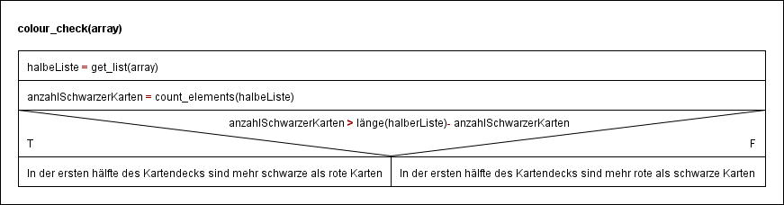

# **Vergleich der Anzahl der roten und schwarzen Karten (Funkion: colour_check)**
Index
----------------
- [Funktion](#funktion)
- [Anforderungen](#anforderungen)
- [Visualisierung](#visualisierung)
- [Teilprobleme](#teilprobleme)
- [Struktogramm](#struktogramm)
- [Input](#input)
## Funktion:
- Es soll ermittelt werden, ob sich in der ersten Hälfte des Kartendecks mehr rote als schwarze Karten befinden.
- Wenn die Anzahl der Karten ungerade ist, wird bei der Halbierung aufgerundet.

## Anforderungen:
- Es befinden sich eine beliebige Anzahl von Karten im Kartendeck.
- Die Farbe einer Karte kann entweder rot oder schwarz sein.

## Visualisierung:


## Teilprobleme:
1. Ausgabe der ersten Hälfte des Kartendecks (Funktion: get_list)
2. Prüfen, ob es sich um eine rote Karte handelt (Funktion: count_elements)
3. Schritt 2. mit allen Karten durchführen und die Schwarzen Zählen (Funktion: count_elements)
4. Die schwarzen mit den roten Karten vergleichen (Funktion: count_elements)


## Struktogramm:


## Input:
- Akzeptierter Input für die Funktion: array = [[colour, number], …]
- colour ist entweder "b" black oder "r" red

Python-Code
--------------------------
```python
def get_list(liste):  # Schritt 1
    return liste[0:round(len(liste) / 2)]


def count_elements(liste):
    counter = 0
    for i in range(0, len(liste)):  # Schritt 3
        if liste[i][0] == "b": counter += 1  # Schritt 2 + Schritt 3
    return counter


def colour_check(liste):
    tmp0 = get_list(liste)
    tmp1 = count_elements(tmp0)
    if tmp1 > len(tmp0)-tmp1: return "Es sind mehr schwarze Karten"
    else: return "Es sind mehr rote Karten"

# Listenformat ist: list = [[colour, number],]
# colour ist entweder "b" black oder "r" red

```
