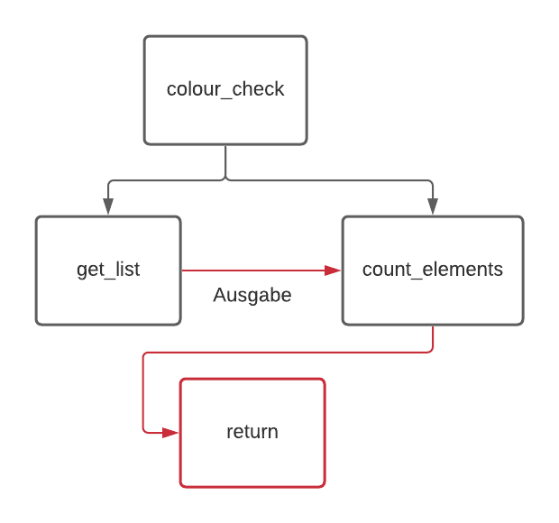

# Vergleich der Anzahl der roten und schwarzen Karten

## Anforderung:
### Es soll ermittelt werden, ob sich in der ersten Hälfte des Kartendecks mehr rote als schwarze Karten befinden.

## Teilprobleme:
### 1. Ausgabe der ersten Hälfte des Kartendecks
### 2. Prüfen, ob es sich um eine rote Karte handelt
### 3. Schritt 2. mit allen Karten durchführen 

## Visualisierung

