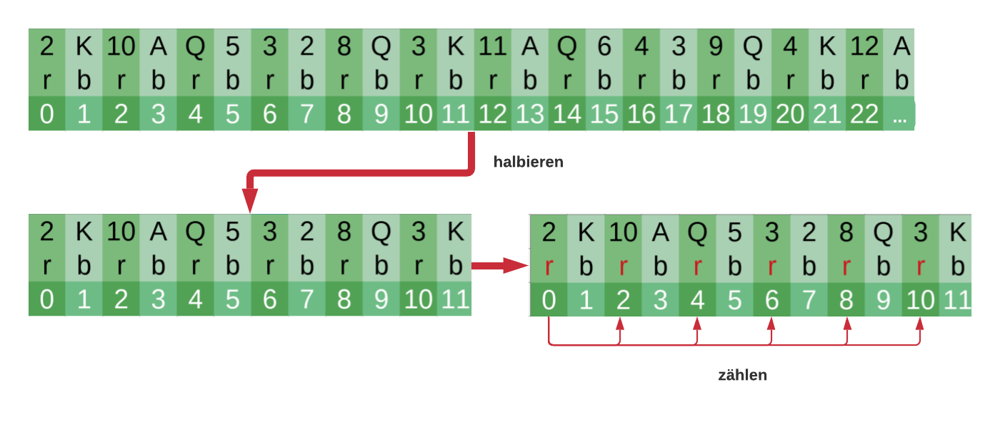

# **Vergleich der Anzahl der roten und schwarzen Karten (Funkion: colour_check)**
## Funktion:
### - Es soll ermittelt werden, ob sich in der ersten Hälfte des Kartendecks mehr rote als schwarze Karten befinden.
### - Wenn die Anzahl der Karten ungerade ist, wird bei der Halbierung aufgerundet.

## Anforderungen:
### - Es befinden sich eine beliebige Anzahl von Karten im Kartendeck.
### - Die Farbe einer Karte kann entweder rot oder schwarz sein.

## Visualisierung:

## Teilprobleme:
### 1. Ausgabe der ersten Hälfte des Kartendecks (Funktion: get_list)
### 2. Prüfen, ob es sich um eine rote Karte handelt (Funktion: count_elements)
### 3. Schritt 2. mit allen Karten durchführen und die Schwarzen Zählen (Funktion: count_elements)
### 4. Die schwarzen mit den roten Karten vergleichen (Funktion: count_elements)

## Input:
### - Akzeptierter Input für die Funktion: array = [[colour, number], …]
### - colour ist entweder "b" black oder "r" red
